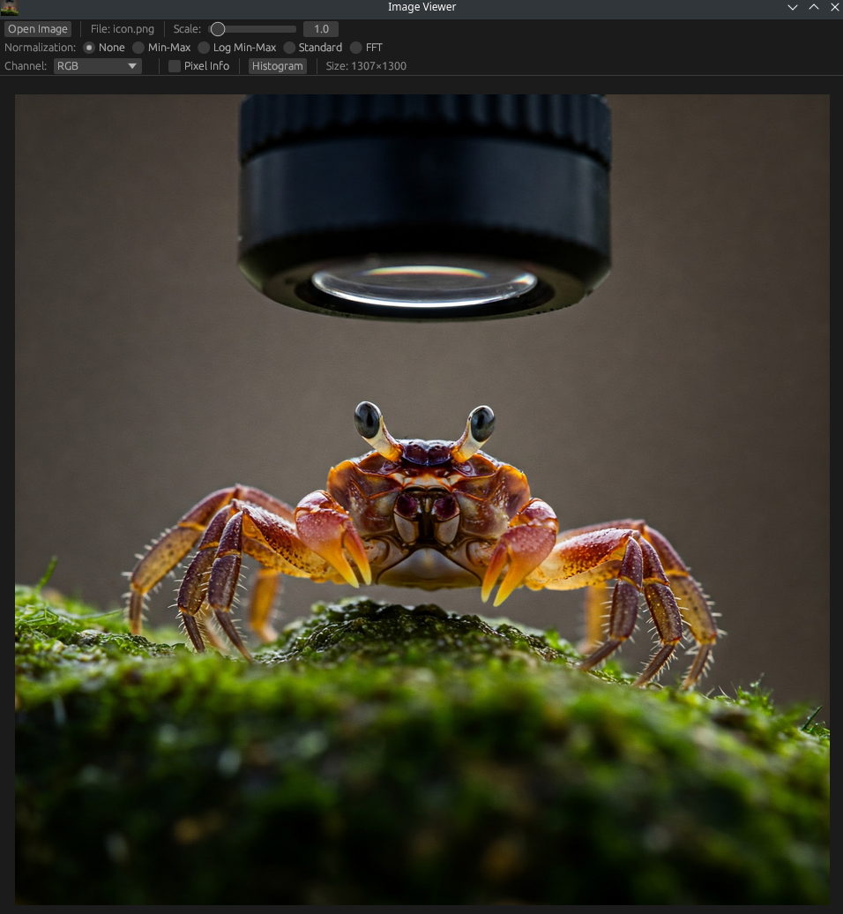

# Image Viewer

A minimalistic Rust image viewer with advanced features for scientific and technical image analysis. Built with eframe/egui for a responsive GUI experience.



## Features

### Image Format Support
- **Standard formats**: PNG, JPG, JPEG, BMP, TIF, TIFF, WebP, GIF, AVIF, HDR, EXR, Farbfeld, QOI, DDS, TGA, PNM, FF, ICO
- **Floating point TIFF**: Special support for 32-bit floating point TIFF files (Gray, RGB, RGBA)
- **Drag & drop**: Drop image files directly onto the window
- **Command line**: Load images by passing file path as argument

### Image Analysis Tools

#### Normalization Types
- **None**: Display original image data
- **Min-Max**: Normalize pixel values to 0-255 range
- **Log Min-Max**: Logarithmic normalization for better visualization of wide dynamic range
- **Standard**: Standardization using mean and standard deviation
- **FFT**: Fast Fourier Transform visualization with windowing function

#### Channel Viewing
- **RGB**: View all channels combined
- **Red**: View only the red channel
- **Green**: View only the green channel
- **Blue**: View only the blue channel

#### Histogram Analysis
- **Multi-channel histogram**: Separate histograms for Red, Green, and Blue channels
- **Hover information**: Displays bin number, count, and percentage when hovering
- **Floating point support**: Calculates histograms from original data when available

#### Pixel Information Tool
- **Coordinate display**: Shows (x, y) coordinates of clicked pixel
- **Value display**: Shows RGB values for regular images or floating point values for FP images
- **Channel-aware**: Displays appropriate format based on image type (Grayscale vs RGB)

## Controls

### Mouse Interaction
- **Zoom**: CTRL + Mouse wheel to zoom in/out (0.1x to 20x magnification)
- **Pan**: Left mouse button drag to pan the image (when pixel tool is disabled)
- **Pixel sampling**: Left click to sample pixel values (when pixel tool is enabled)

### UI Controls
- **Open Image**: Button to open file dialog
- **Scale slider**: Manual zoom control
- **Normalization**: Radio buttons to select normalization type
- **Channel dropdown**: Select which channels to display
- **Pixel Info checkbox**: Toggle pixel inspection mode
- **Histogram button**: Toggle histogram window

### Loading Images
- **File dialog**: Use "Open Image" button
- **Drag & drop**: Drop image files onto the window
- **Command line**: `./image_viewer path/to/image.jpg`

## Advanced Features

### Floating Point Image Support
- Direct TIFF decoder for 32-bit floating point formats
- Preserves original floating point values for accurate analysis
- Proper normalization handling for floating point ranges
- Shows true floating point values in pixel sampling

### Performance Optimizations
- Texture caching to avoid unnecessary regeneration
- Smart scaling that only resizes when displaying smaller than original
- Lazy histogram calculation only when window is opened
- Efficient GPU-based image rendering

## Installation

### From Source
```bash
git clone https://github.com/branislavhesko/image_viewer.git
cd image_viewer
cargo build --release
```

### From Releases
Download precompiled binaries from the [Releases page](https://github.com/branislavhesko/image_viewer/releases):
- `image_viewer-linux-x86_64` - Linux executable
- `image_viewer-windows-x86_64.exe` - Windows executable

## Usage Examples

```bash
# Open file dialog
./image_viewer

# Load specific image
./image_viewer path/to/image.tiff

# Load floating point TIFF for scientific analysis
./image_viewer scientific_data.tiff
```

## Requirements

### Linux
- OpenGL support
- GTK development libraries (for file dialogs)

### Windows
- Windows 7 or later
- OpenGL support

Feature requests and bug reports are welcome!
